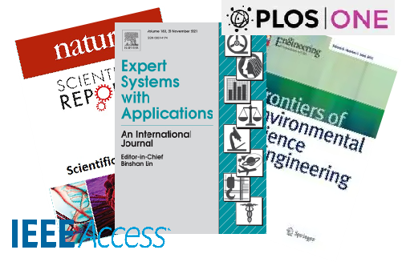

# 🧠 Research Group on Intelligent Systems and Applied Machine Learning

  

    
The **Research Group on Intelligent Systems and Applied Machine Learning (ISAML)** focuses on advancing research in **artificial intelligence**, **machine learning**, and **natural language processing**.  
Our work explores **graph neural networks**, **transformer architectures**, **optimization algorithms**, and **domain generalization**, with the aim of bridging theoretical innovation and real-world application.  

Since **2024**, our members have published high-quality papers in international journals such as *Expert Systems with Applications*, *PLOS ONE*, *Scientific Reports*, *IEEE Access*, and *Frontiers in Environmental Science*.  
Through interdisciplinary collaboration, we strive to develop **trustworthy, interpretable, and high-performance AI systems** that contribute to scientific and societal progress.

> “We bridge theory and practice — empowering intelligent systems through innovation and collaboration.”

  

  

    
  

## 🤝 Collaborating Institutions

  <table style="margin:0 auto; max-width:900px; width:100%; table-layout:fixed;">
    <tr>
      <td align="center" style="padding:12px;">
        
        
<b>Jiangsu Open University</b>

      </td>
      <td align="center" style="padding:12px;">
        
        
<b>Northeastern University</b>

      </td>
      <td align="center" style="padding:12px;">
        
        
<b>Macau University of Science and Technology</b>

      </td>
    </tr>
    <tr>
      <td align="center" style="padding:12px;">
        
        
<b>Juniata College</b>

      </td>
      <td align="center" style="padding:12px;">
        
        
<b>Guangxi University</b>

      </td>
      <td align="center" style="padding:12px;">
        
        
<b>Yangzhou University</b>

      </td>
    </tr>
  </table>

## 👥 Team Members Introduction

### Qining Luo

<table style="width:200%;">
  <!-- Row 1: avatar + brief info -->
  <tr>
    <td style="width:120px; vertical-align:top; padding-right:12px;">
      
    </td>
    <td style="vertical-align:top;">
      <strong>Name:</strong> Qiyu Luo (罗起宁) &nbsp;·&nbsp;
      <strong>Email:</strong> <a href="mailto:bith6165@gmail.com">bith6165@gmail.com</a> &nbsp;·&nbsp;
      <strong>University:</strong> Guangxi Police College
        
      <strong>Experience</strong>
      <ul style="margin-top:6px;">
        <li><em>2024.09–2025.03</em> · Institute of Software, CAS · MindSpore Open-Source Dev Intern — Built <b>CGL-MHA</b> sarcasm model (CNN/GRU/LSTM + multi-head attention) on MindSpore; end-to-end training/validation/optimization.</li>
        <li><em>2023.03–Present</em> · Big Data & Policing Tech Lab, Guangxi Police College · Research Assistant — Experiments & figures across optimization, GNNs, sentiment analysis, anomaly detection, materials screening, and self-supervised learning.</li>
      </ul>
    </td>
  </tr>

  <!-- Row 2: publications inside the same table -->
  <tr>
    <td colspan="2" style="padding-top:8px;">

**Selected Publications (DOIs where available)**

1. **An Improvement by Introducing LBFGS Idea into the Adam Optimizer for Machine Learning** — *Expert Systems with Applications*  
   DOI: <a href="https://doi.org/10.1016/j.eswa.2025.129002">10.1016/j.eswa.2025.129002</a>

2. **Multimodal GRU with Directed Pairwise Cross-Modal Attention for Sentiment Analysis** — *Scientific Reports*  
   DOI: <a href="https://doi.org/10.1038/s41598-025-93023-3">10.1038/s41598-025-93023-3</a>

3. **Enhancing intrusion detection performance using GCN-LOF: A hybrid graph-based anomaly detection approach**  
   DOI: <a href="https://doi.org/10.1016/j.comnet.2025.111606">10.1016/j.comnet.2025.111606</a>

4. **Detecting Illicit Transactions in Bitcoin: A Wavelet-Temporal Graph Transformer Approach for Anti-Money Laundering**  
   DOI: —

5. **Enhancing Intrusion Detection Performance Using GCN-LOF: A Hybrid Graph-Based Anomaly Detection Approach**  
   DOI: <a href="https://doi.org/10.1016/j.comnet.2025.111606">10.1016/j.comnet.2025.111606</a>

6. **GCN-Based Framework for Materials Screening and Phase Identification** — *Materials*  
   DOI: <a href="https://doi.org/10.3390/ma18050959">10.3390/ma18050959</a>

7. **Detecting sarcasm in user-generated content integrating transformers and gated graph neural networks** — *PeerJ Computer Science*  
   DOI: <a href="https://doi.org/10.7717/peerj-cs.2817">10.7717/peerj-cs.2817</a>

8. **MAS-LSTM: A Multi-Agent LSTM-Based Approach for Scalable Anomaly Detection in IIoT Networks** — *Processes*  
    DOI: <a href="https://doi.org/10.3390/pr13030753">10.3390/pr13030753</a>

9. **Self-Supervised Learning for Domain Generalization with a Multi-Classifier Ensemble Approach** — *IET Image Processing*  
    DOI: <a href="https://doi.org/10.1049/ipr2.70098">10.1049/ipr2.70098</a>

    </td>
  </tr>
</table>

### Baozhong Wei

<table style="width:100%;">
  <!-- Row 1: avatar + brief info (placeholders allowed empty) -->
  <tr>
    <td style="width:120px; vertical-align:top; padding-right:12px;">
      
    </td>
    <td style="vertical-align:top;">
      <strong>Name:</strong> Baozhong Wei &nbsp;·&nbsp;
      <strong>Email:</strong> — &nbsp;·&nbsp;
      <strong>University:</strong> —
        
      <strong>Experience</strong>
      <ul style="margin-top:6px;">
        <li>—</li>
      </ul>
    </td>
  </tr>

  <!-- Row 2: publications inside the same table -->
  <tr>
    <td colspan="2" style="padding-top:8px;">

**Publications** (Status: Under peer review / Initial review / Accepted / Published / Journal selection)

1. **Modeling Carbon Price Dynamics Driven by External Factors: A Hybrid Framework Combining Mamba State-Space Model and Transformer**  · **Under peer review** · DOI: —
2. **Enhancing Grid Stability and Renewable Energy Integration with an Advanced Dual-Domain Photovoltaic Power Forecasting Framework**  · **Initial review** · DOI: —
3. **SFDformer: A Frequency-Based Sparse Decomposition Transformer for Air Pollution Time Series Prediction**· **Published** · *Frontiers in Environmental Science* · DOI: <a href="https://doi.org/10.3389/fenvs.2025.1549209">10.3389/fenvs.2025.1549209</a>
4. **ACSAformer: A Crime Forecasting Model Based on Sparse Attention and Adaptive Graph Convolution**· **Published** · *Frontiers in Physics* · DOI: <a href="https://doi.org/10.3389/fphy.2025.1596987">10.3389/fphy.2025.1596987</a>
5. **KEDformer: Knowledge Extraction Seasonal Trend Decomposition for Long-term Sequence Prediction**· **Accepted** · DOI: —
6. **CMDMamba: Dual-Layer Mamba Architecture with Dual Convolutional Feed-Forward Networks for Efficient Financial Time Series Forecasting**  · **Published** · *Frontiers in Artificial Intelligence* · DOI: <a href="https://doi.org/10.3389/frai.2025.1599799">10.3389/frai.2025.1599799</a>
7. **TC-Linear: Lightweight Traffic Speed Forecasting via Trend-Seasonal Decomposition and Temporal Convolution** · **Accepted** · DOI: —
8. **Modeling Cryptocurrency Price Dynamics Across Scales and Assets: A Framework Incorporating Decoupled Temporal–Variable Attention and Segment Merging** — Rank: JCR Q2 (Area IV) · **Under peer review** · DOI: —
9. **CCformer: Covariate-aware Cross-Attention and Convolutional Network Model for Sports Crowd Flow Forecasting** · **Initial review** · DOI: —
10. **Reliable Prediction on Small Medical Tabular Data with a Graph-Enhanced Transformer**  · **Journal selection** · DOI: —
11. **Temporal-Structural Modeling for Cryptocurrency Price Forecasting: A Framework Based on Reversed Embedding and Adaptive Graph Convolution** · **Journal selection** · DOI: —

    </td>
  </tr>
</table>

---

### Dongze Wu

<table style="width:100%;">
  <!-- Row 1: avatar + brief info (placeholders allowed empty) -->
  <tr>
    <td style="width:120px; vertical-align:top; padding-right:12px;">
      
    </td>
    <td style="vertical-align:top;">
      <strong>Name:</strong> Dongze Wu &nbsp;·&nbsp;
      <strong>Email:</strong> — &nbsp;·&nbsp;
      <strong>University:</strong> —
        
      <strong>Experience</strong>
      <ul style="margin-top:6px;">
        <li>—</li>
      </ul>
    </td>
  </tr>

  <!-- Row 2: publications inside the same table -->
  <tr>
    <td colspan="2" style="padding-top:8px;">

**Publications**

1. **DynSpecNet: Dynamic Spectral Representation Learning for Anomaly Detection in Open-Source Intelligence Graphs** · **Initial review** · DOI: —
2. **Building an intelligent diabetes Q&A system with knowledge graphs and large language models** · **Published** · *Frontiers in Public Health* · DOI: <a href="https://doi.org/10.3389/fpubh.2025.1540946">10.3389/fpubh.2025.1540946</a>
3. **Detecting Illicit Transactions in Bitcoin: A Wavelet-Temporal Graph Transformer Approach for Anti-Money Laundering**· **Accepted** · DOI: —
4. **FEAM: A Dynamic Prompting Framework for Sentiment Analysis with Hierarchical Convolutional Attention**· **Published** · *Frontiers in Physics* · DOI: <a href="https://doi.org/10.3389/fphy.2025.1674949">10.3389/fphy.2025.1674949</a>
5. **DP-FWCA: A Prompt-Enhanced Model for Named Entity Recognition in Educational Domains** · **Published** · *IEEE Access* · DOI: <a href="https://doi.org/10.1109/ACCESS.2025.3590851">10.1109/ACCESS.2025.3590851</a>
6. **DynProGC-BERT: A Dynamic Prompt and Global-Context Gated Convolutional Framework for Robust Hate Speech Detection** · **Under peer review** · DOI: —

    </td>
  </tr>
</table>

© 2025 Intelligent Systems and Applied Machine Learning Group. All rights reserved.
